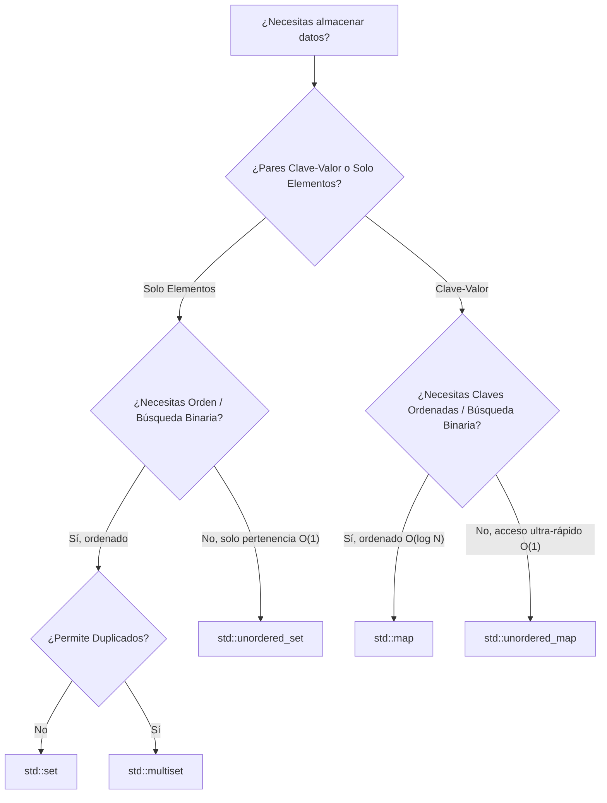

# 📦 Estructuras de Datos de la STL en Competitive Programming

Guía definitiva de las estructuras asociativas y ordenadas más utilizadas en C++: `std::set`, `std::multiset`, `std::map`, `std::unordered_map` y `std::unordered_set`. Incluye métodos esenciales, complejidades, patrones recurrentes y trampas mortales en competencias.

---

## 📌 Tabla de Contenidos
1. [Panorama General y Complejidades](#1-panorama-general-y-complejidades)
2. [`std::set` (Conjunto Ordenado Único)](#2-stdset-conjunto-ordenado-único)
3. [`std::multiset` (Conjunto Ordenado con Duplicados)](#3-stdmultiset-conjunto-ordenado-con-duplicados)
4. [`std::map` (Diccionario / Mapa Ordenado)](#4-stdmap-diccionario--mapa-ordenado)
5. [`std::unordered_map` y `std::unordered_set` (Tablas Hash)](#5-stdunordered_map-y-stdunordered_set-tablas-hash)
6. [Comparadores Personalizados (`Custom Comparators`)](#6-comparadores-personalizados-custom-comparators)
7. [Resumen y Cheatsheet Rápido](#7-resumen-y-cheatsheet-rápido)

---

## 1. Panorama General y Complejidades

| Estructura | Estructura Interna | Ordenada | Permite Duplicados | Búsqueda / Inserción / Borrado |
|---|---|:---:|:---:|:---:|
| `std::set<T>` | Red-Black Tree (BST Balanceado) | ✅ Sí | ❌ No | O(log N) |
| `std::multiset<T>` | Red-Black Tree (BST Balanceado) | ✅ Sí | ✅ Sí | O(log N) |
| `std::map<K, V>` | Red-Black Tree (BST Balanceado) | ✅ Sí (por clave) | ❌ No (claves únicas) | O(log N) |
| `std::unordered_set<T>` | Hash Table con buckets | ❌ No | ❌ No | O(1) promedio / O(N) peor caso |
| `std::unordered_map<K, V>`| Hash Table con buckets | ❌ No | ❌ No (claves únicas) | O(1) promedio / O(N) peor caso |

---

## 2. `std::set` (Conjunto Ordenado Único)

Mantiene elementos **únicos** en orden **ascendente** estricto por defecto.

### Métodos Más Frecuentes

```cpp
set<int> s;

// 1. Inserción — O(log N)
s.insert(10);
s.insert(5);
s.insert(20);
// s ahora contiene: {5, 10, 20} (ordenado automáticamente)

// 2. Búsqueda y Pertenencia — O(log N)
if (s.count(10)) { /* existe */ }
if (s.find(10) != s.end()) { /* existe (retorna iterador) */ }

// En C++20:
// if (s.contains(10)) { ... }

// 3. Borrado por valor o iterador — O(log N)
s.erase(10); // Borra el valor 10 si existe

auto it = s.find(5);
if (it != s.end()) s.erase(it); // Borra usando el iterador

// 4. Cotas y Búsqueda Binaria Interna — O(log N)
auto it1 = s.lower_bound(15); // Primer elemento >= 15 (apunta a 20)
auto it2 = s.upper_bound(20); // Primer elemento > 20 (apunta a s.end())

// 5. Tamaño y Estado — O(1)
int n = s.size();
bool vacio = s.empty();
s.clear(); // Vacía todo el set en O(N)
```

### Recorrer e Inspeccionar Extremos

```cpp
set<int> s = {3, 1, 4, 1, 5, 9}; // Guarda {1, 3, 4, 5, 9}

// Elemento mínimo: O(1)
int minimo = *s.begin(); // 1

// Elemento máximo: O(1)
int maximo = *s.rbegin(); // 9 (usando reverse iterator)
// o alternativamente: int maximo = *prev(s.end());

// Recorrer en orden creciente:
for (int x : s) cout << x << " "; // 1 3 4 5 9

// Recorrer en orden decreciente:
for (auto it = s.rbegin(); it != s.rend(); ++it) cout << *it << " "; // 9 5 4 3 1
```

---

## 3. `std::multiset` (Conjunto Ordenado con Duplicados)

Idéntico a `std::set`, pero **permite múltiples copias del mismo valor**. Esencial cuando necesitas una cola de prioridad con soporte para buscar y eliminar elementos arbitrarios en $O(\log N)$.

### ⚠️ TRAMPA #1: `erase(val)` vs `erase(it)`

Esta es una de las fuentes de bugs más comunes en competencias:

```cpp
multiset<int> ms = {4, 4, 4, 8};

// ❌ BORRA TODAS LAS COPIAS:
ms.erase(4);
// ms queda como: {8} (¡perdiste todos los 4!)

// ✅ BORRA SOLO UNA INSTANCIA:
auto it = ms.find(4); // o ms.lower_bound(4)
if (it != ms.end()) {
    ms.erase(it);
}
// ms queda como: {4, 4, 8} (solo se eliminó una copia)
```

> [!CAUTION]
> En `multiset`, pasar un **valor** a `erase(val)` borra **todas** las ocurrencias. Para borrar una sola copia, busca primero el **iterador** con `ms.find(val)` o `ms.lower_bound(val)` y pásaselo a `ms.erase(it)`.

### ⚠️ TRAMPA #2: `count(val)` NO es $O(\log N)$

```cpp
multiset<int> ms;
// Supón que ms tiene 200,000 elementos iguales a 5

// ❌ PÉSIMO: O(log N + frecuencia) -> O(N) TLE
if (ms.count(5)) { ... }

// ✅ CORRECTO: O(log N) siempre
if (ms.find(5) != ms.end()) { ... }
```
`ms.count(val)` recorre **todos** los duplicados para contarlos linealmente. Si solo quieres verificar existencia, usa siempre `find()` o `lower_bound()`.

---

## 4. `std::map` (Diccionario / Mapa Ordenado)

Almacena pares clave-valor (`pair<const Key, Value>`), manteniendo las claves ordenadas de menor a mayor.

### Métodos Más Frecuentes

```cpp
map<string, int> mp;

// 1. Inserción y Asignación — O(log N)
mp["alice"] = 100;
mp.insert({"bob", 80});

// 2. Acceso por Clave
int score = mp["alice"]; // Retorna 100

// 3. Búsqueda Segura sin Crear Elementos Fantasma — O(log N)
auto it = mp.find("charlie");
if (it != mp.end()) {
    cout << "Valor: " << it->second << "\n";
} else {
    cout << "No existe\n";
}

// 4. Borrado — O(log N)
mp.erase("alice"); // Borra la clave y su valor

// 5. Binary Search sobre Claves — O(log N)
map<int, string> eventos;
eventos[10] = "Inicio";
eventos[25] = "Pausa";
eventos[50] = "Fin";

// Primer evento con tiempo >= 20:
auto itEv = eventos.lower_bound(20); // itEv->first es 25, itEv->second es "Pausa"
```

### ⚠️ El Peligro del `operator[]`: Elementos Fantasma

```cpp
map<string, int> freq;

// ⚠️ Si la clave "dragon" no existía, operator[] la INSERTA con valor por defecto 0!
if (freq["dragon"] > 0) { ... }

// Ahora freq.size() aumentó en 1 y existe {"dragon", 0}!
// Si luego recorres el mapa, "dragon" estará presente.

// ✅ Forma correcta de verificar sin modificar el mapa:
if (freq.count("dragon") && freq["dragon"] > 0) { ... }
// o con find():
auto it = freq.find("dragon");
if (it != freq.end() && it->second > 0) { ... }
```

---

## 5. `std::unordered_map` y `std::unordered_set` (Tablas Hash)

Implementadas como tablas hash. No mantienen orden, pero ofrecen operaciones en **$O(1)$ promedio**.

### ⚠️ EL ATAQUE HASH EN CODEFORCES (Anti-hash TLE)

En plataformas como Codeforces donde las pruebas son públicas y otros participantes pueden hackear tus envíos durante la fase de impugnaciones:
- El hash por defecto de `std::unordered_map<long long, int>` en GCC (`std::hash`) es vulnerable a colisiones prediseñadas.
- Un test malicioso diseñado contra la función hash de GCC hace que todas las inserciones caigan en el mismo bucket, degradando la complejidad de $O(1)$ a **$O(N)$ por operación**, resultando en un TLE brutal ($O(N^2)$).

#### La Solución Oficial: `custom_hash` con SplitMix64
Pega este snippet en tu plantilla cuando uses `unordered_map` o `unordered_set`:

```cpp
struct custom_hash {
    static uint64_t splitmix64(uint64_t x) {
        // http://xorshift.di.unimi.it/splitmix64.c
        x += 0x9e3779b97f4a7c15;
        x = (x ^ (x >> 30)) * 0xbf58476d1ce4e5b9;
        x = (x ^ (x >> 27)) * 0x94d049bb133111eb;
        return x ^ (x >> 31);
    }

    size_t operator()(uint64_t x) const {
        static const uint64_t FIXED_RANDOM = chrono::steady_clock::now().time_since_epoch().count();
        return splitmix64(x + FIXED_RANDOM);
    }
};

// Uso en tu código:
unordered_map<long long, int, custom_hash> seguro_map;
unordered_set<long long, custom_hash> seguro_set;
```

> [!TIP]
> Si el número de elementos es moderado (N ≤ 2e5) y el tiempo límite es estándar (≥ 1.0s), a menudo un `std::map` regular con O(N log N) es más seguro y no puede ser hackeado.

---

## 6. Comparadores Personalizados (`Custom Comparators`)

Por defecto, los contenedores ordenados ordenan de menor a mayor (`std::less<T>`).

### 1. Orden Descendente (Mayor a Menor)
```cpp
// Set de mayor a menor:
set<int, greater<int>> s_desc;
s_desc.insert(10);
s_desc.insert(50);
s_desc.insert(20);
// Elementos: 50, 20, 10
// *s_desc.begin() ahora es el MÁXIMO (50)
```

### 2. Comparador para Estructuras Propias
```cpp
struct Interval {
    int l, r, id;
};

// Ordenar por 'l' ascendente, y ante empate por 'r' descendente:
struct CompareInterval {
    bool operator()(const Interval& a, const Interval& b) const {
        if (a.l != b.l) return a.l < b.l;
        return a.r > b.r;
    }
};

set<Interval, CompareInterval> intervals;
```

> [!IMPORTANT]
> Los comparadores de `set` y `map` deben implementar **Strict Weak Ordering**:
> - Si `a == b`, `cmp(a, b)` debe retornar `false`.
> - Si usas `<=` en vez de `<`, el contenedor asumirá que ningún par es igual y el comportamiento será errático o fallará en compilar.

---

## 7. Resumen y Cheatsheet Rápido

### ¿Cuál estructura elegir?



### Métodos Esenciales y sus Complejidades

| Operación | `std::set` | `std::multiset` | `std::map` | `std::unordered_map` |
|---|:---:|:---:|:---:|:---:|
| Insertar elemento | `s.insert(x)` [O(log N)] | `ms.insert(x)` [O(log N)] | `mp[k] = v` [O(log N)] | `ump[k] = v` [O(1)] |
| Buscar existencia | `s.count(x)` [O(log N)] | `ms.find(x) != ms.end()` [O(log N)] | `mp.count(k)` [O(log N)] | `ump.count(k)` [O(1)] |
| Borrar 1 elemento | `s.erase(x)` [O(log N)] | `ms.erase(ms.find(x))` [O(log N)] | `mp.erase(k)` [O(log N)] | `ump.erase(k)` [O(1)] |
| Borrar todas copias| `s.erase(x)` [O(log N)] | `ms.erase(x)` [O(k + log N)] | N/A | N/A |
| Primer ≥ X | `s.lower_bound(x)` [O(log N)] | `ms.lower_bound(x)` [O(log N)] | `mp.lower_bound(k)` [O(log N)] | ❌ No soportado |
| Mínimo elemento | `*s.begin()` [O(1)] | `*ms.begin()` [O(1)] | `mp.begin()->first` [O(1)] | ❌ No soportado |
| Máximo elemento | `*s.rbegin()` [O(1)] | `*ms.rbegin()` [O(1)] | `mp.rbegin()->first` [O(1)] | ❌ No soportado |
